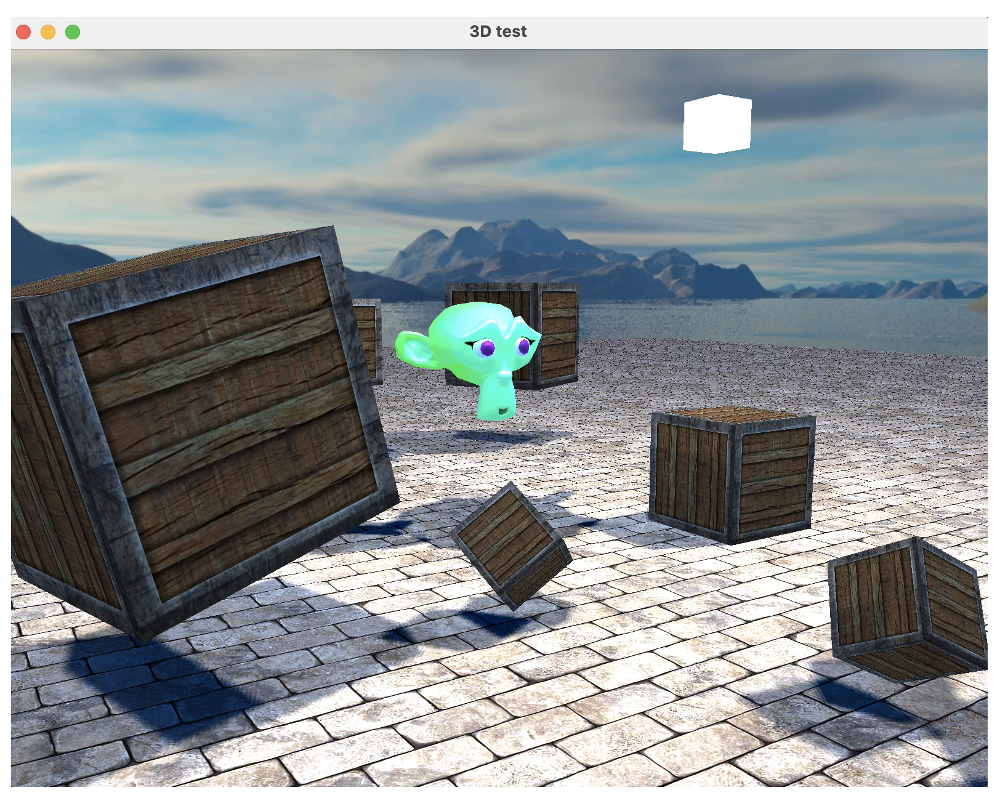
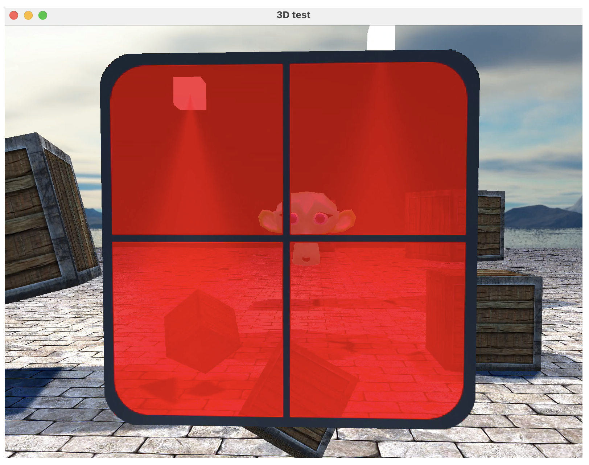
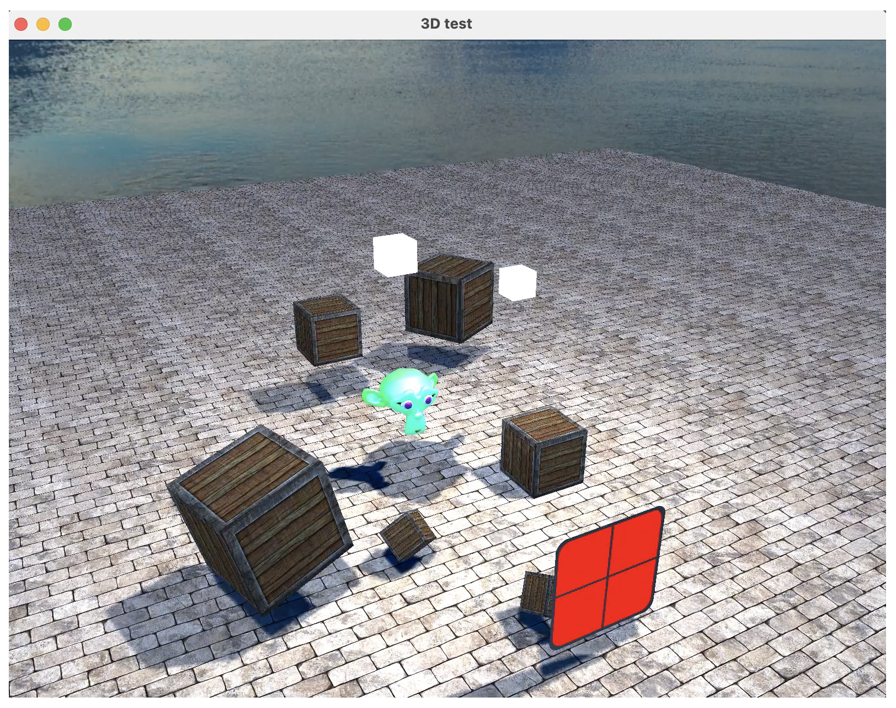

# OpenGL walkthrough
This project was made during my second years of Banchlor degree in the Computer Graphics course to indroduce myself at the basic of computer graphics tecniques using C++ and OpenGL.

It's a set of basic class and structures that I made to create and manipulate 2D and 3D object in OpenGL with C++ and I use them to create a basic scene to test all the tecniques i learn like:

- Basic randaring with VBO, indeces 
- Basic of shadeing lenguage
- Prorspective and Orgogonal Camera 
- Bling-Phong lighting
- Shadow mapping
- Model loading with texture
- Blending

### Run code
To run the code I wrote a Makefile that execute the basics compile commands. To compile:
```
make
```
And to run the code just use the executable file:
```
./main
```

### Images
<div></div>

<div></div>
<div></div>

### References
To help my studing I use the following resources:
- [LearnOpenGL](https://learnopengl.com/) very usefull with complete lessons
- [Book](https://www.amazon.it/Introduction-Computer-Graphics-Practical-Geometric-ebook/dp/B07NPSGGLS?ref_=ast_author_mpb) Professor book and materials